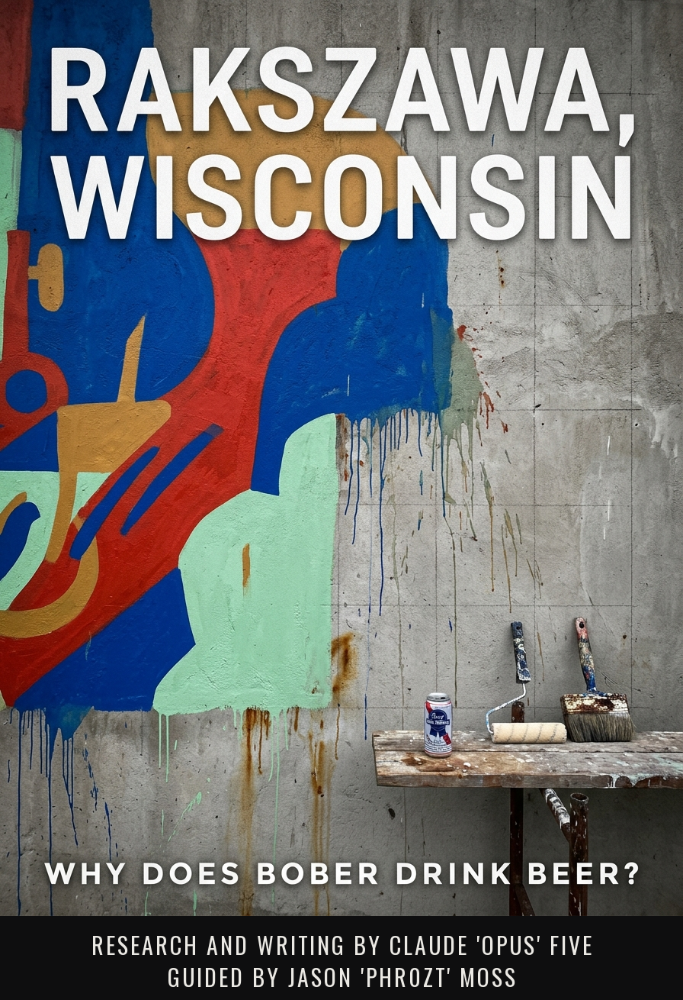

<div align="center">



# Rakszawa, Wisconsin

### Why Does Bober Drink Beer?

**Six Centuries, One Wall, and a Can That Lies About Where It Comes From**

*Jason 'phr0zt' Moss*

**English &nbsp;|&nbsp; Francais &nbsp;|&nbsp; Polski**

</div>

---

## The short version

Lukasz Bober is a Polish mixed-media artist, musician and muralist. He paints
massive walls into colorful life, he does not give a fuck, he loves books, and
somewhere around half past three in the afternoon he opens a can of Pabst Blue
Ribbon.

This book takes the question "why?" far too seriously, and finds six answers.
Five of them are wrong.

The Pabst Blue Ribbon sold in Poland was licence-brewed **in Poland**, by Van
Pur at Rakszawa in Podkarpacie, and sold in Polomarket for the price of any
other lager. The blue ribbon on the can commemorates a prize that was never
awarded -- the 1893 Chicago fair gave identical bronze medals to every beer
that scored above 80%, and the slogan was written in the 1950s. The famous
finding that alcohol makes you more creative failed a preregistered,
double-blind replication at **p = .98**.

So it is not an import, it is not a medal, and it is not a muse.

What it is, the book argues in its final chapter, is an **authorised stop**.
Muralists are paid by the square metre. The painting is billable. The looking
is not, the deciding is not, and the standing back and hating it is not. Polish
has a dictionary entry for the friend you only drink with, and a diminutive for
the drink that ends the session, and no word at all for an hour of unpaid
thinking.

The beer is a receipt for time that has no invoice.

---

## Download

| | EPUB | PDF |
|---|---|---|
| **English** | [Rakszawa-Wisconsin-EN.epub](Rakszawa-Wisconsin-EN.epub) | [Rakszawa-Wisconsin-EN.pdf](Rakszawa-Wisconsin-EN.pdf) |
| **Francais** | [Rakszawa-Wisconsin-FR.epub](Rakszawa-Wisconsin-FR.epub) | [Rakszawa-Wisconsin-FR.pdf](Rakszawa-Wisconsin-FR.pdf) |
| **Polski** | [Rakszawa-Wisconsin-PL.epub](Rakszawa-Wisconsin-PL.epub) | [Rakszawa-Wisconsin-PL.pdf](Rakszawa-Wisconsin-PL.pdf) |

Five chapters, about 13,000 words. EPUBs are e-ink optimised; PDFs are set A5,
the size of an actual book.

---

## The chapters

**1. The Light Goes Flat at Half Past Three**
The first beer arrives at a precise, non-arbitrary moment -- when the light
flattens and he can no longer judge colour. That timing makes this a question
about work, not about weakness.

**2. Eighth Place, and Falling**
Poland ranks eighth in Europe for alcohol consumption and is falling. The
drunken-Pole stereotype is quantitatively false, so national character explains
nothing.

**3. What the Dues Did Not Take, the Vodka Took**
Six centuries of *propinacja*: landlords held the monopoly, peasants took the
compulsory quota, and the profit went up. In 1844-1855 hundreds of thousands of
Galician serfs swore off drink -- and their landlords petitioned to ban the
sermons.

**4. A Prize Nobody Won, A Muse Nobody Found**
The medal is invented, the beer is Polish, and the science that flattered every
drinking artist collapsed under replication.

**5. Ten Minutes Nobody Pays For**
What is actually true, and it is smaller and better than a muse.

---

## How this was built

Ten AI agents, roughly 90,000 words of source-cited research standing behind
13,000 words of book. Every fact carried a verification flag; anything that
could not be sourced was cut rather than softened.

Some of what the research killed on the way:

- **The 1893 blue ribbon.** Primary sources from the exposition rules and
  Bancroft's *Book of the Fair*: no gold, no silver, no ribbons. Both the Pabst
  Mansion and the Wisconsin Historical Society have corrected their own sites.
- **"Uncorking the muse."** The 2012 study was 40 men, no placebo group, one
  15-item task with internal reliability of .45. Benedek and Zohrer's 2020
  preregistered replication, N = 125, returned p = .98.
- **"Na trzeciego."** A drinking custom the author believed was a Polish idiom.
  It is not one, confirmed independently twice, and it never reached the page.
- **"Pijany jak szewc."** Not in the PAN dictionary. What is codified is *klnie
  jak szewc* -- in official Polish the cobbler swears; he does not drink.

Built from the public work of **Kate Fox** (drunken behaviour is a cultural
script, not a chemical), **Mark Lawrence Schrad** (the state was always the
pusher), and **Ziemowit Szczerek** (the view from inside the country), with
**Jerzy Pilch**, **Wojciech Smarzowski**, **Kacper Poblocki**, **Wladyslaw
Reymont**, and the *Wielki slownik jezyka polskiego* of the Polish Academy of
Sciences.

---

## Repository

```
en/  fr/  pl/     chapter sources, one markdown file per chapter
build/            cover, stylesheets, translation brief
research/         the dossiers -- ~90,000 words, every claim flagged
book/             English working files and build assets
*.epub  *.pdf     the six published editions
```

---

<div align="center">

Research and writing by Claude 'Opus' Five. Guided by Jason 'phr0zt' Moss.

</div>
